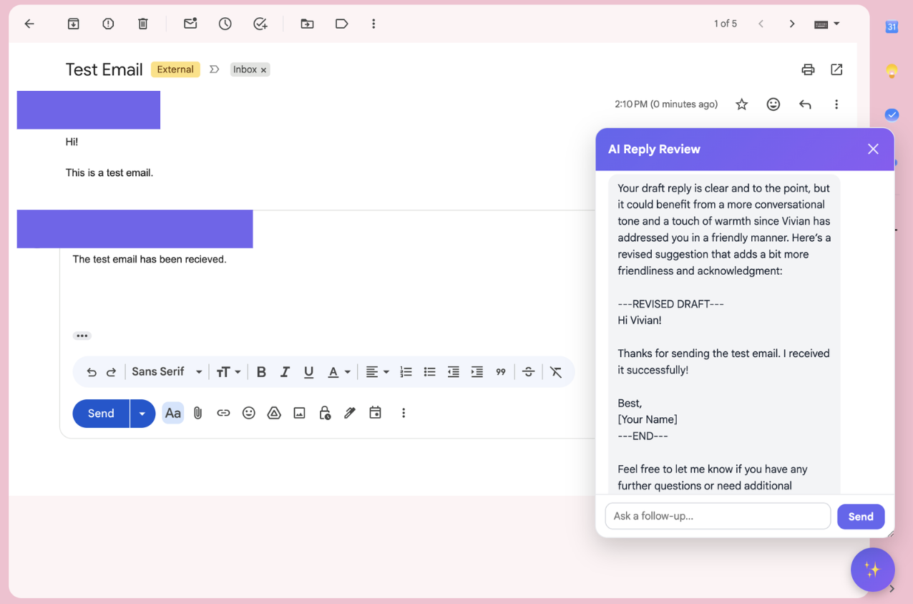

# Gmail AI Reply Reviewer

A Chrome extension that reads the open Gmail thread and your in-progress reply, then uses an LLM to give you live feedback on tone, clarity, and completeness — right inside Gmail, with a follow-up chat for questions about the suggestion.

## Demo



## Key Features

- **In-page Gmail integration** — injects a floating review button and chat panel directly into `mail.google.com` via a Manifest V3 content script, isolated from Gmail's styles with a Shadow DOM.
- **Thread-aware context extraction** — parses the open Gmail thread's DOM to reconstruct sender, message body, and collapsed/expanded state for every message, plus the current compose box draft.
- **Client-side email redaction** — every email address found in the extracted thread is replaced with a consistent `[email-N]` placeholder before anything leaves the browser, so raw addresses are never sent to the backend.
- **Conversational review** — the backend forwards the redacted thread + draft to OpenAI with a system prompt tuned for tone/clarity/completeness feedback, and supports multi-turn follow-up questions about the suggestion.
- **Structured rewrite extraction** — the model wraps any suggested rewrite in explicit markers so it can be parsed out programmatically (parsing not yet wired into the UI — see [Future Improvements](#future-improvements)).
- **Decoupled selector config** — a `/selectors` backend endpoint exists so Gmail's DOM selectors can in principle be updated server-side without shipping a new extension version.

## Tech Stack

`JavaScript (Manifest V3) • Python • FastAPI • OpenAI API • Uvicorn • Pydantic • pytest • Railway`

## How It Works

```
Gmail thread + draft (DOM)
        │  content script: extract + redact emails
        ▼
Chrome extension UI (Shadow DOM panel)
        │  POST /review  {conversation}
        ▼
FastAPI backend  (backend/routers/review.py)
        │  chat.completions.create(...)
        ▼
OpenAI API  (gpt-4o-mini by default)
        │  feedback + optional ---REVISED DRAFT--- block
        ▼
Chat panel rendered back in Gmail
```

The backend is a thin, mostly stateless relay: it holds the system prompt and the OpenAI credentials, and has no database or user accounts. Each `/review` call resends the full conversation, since the API itself is stateless between requests.

## Project Structure

```text
backend/            FastAPI service
  main.py             App entrypoint, CORS, route registration, /health
  config.py           Environment-based configuration (.env)
  routers/
    review.py          POST /review — forwards conversation to OpenAI
    selectors.py        GET /selectors — Gmail DOM selector config
  tests/               pytest suite for the endpoints above
  requirements.txt     Runtime dependencies
  requirements-dev.txt Runtime + test dependencies
  Procfile             Railway start command

extension/           Chrome extension (Manifest V3)
  manifest.json        Extension manifest
  content.js           Gmail DOM extraction, redaction, and UI injection

assets/screenshots/  README images
```

## Getting Started

### 1. Clone

```bash
git clone https://github.com/viviankahm07/ai-email-reviewer.git
cd ai-email-reviewer
```

### 2. Run the backend

```bash
cd backend
python3 -m venv venv
source venv/bin/activate
pip install -r requirements.txt

cp .env.example .env
# then edit .env and set OPENAI_API_KEY

uvicorn main:app --reload
```

The API is now available at `http://127.0.0.1:8000` (`/health` should return `{"status": "ok"}`).

### 3. Load the extension

1. In Chrome, open `chrome://extensions`, enable **Developer mode**, and click **Load unpacked**.
2. Select the `extension/` folder.
3. `extension/content.js` points `BACKEND_BASE_URL` at `http://127.0.0.1:8000` by default, matching the local backend above. If you deploy your own backend elsewhere, update that constant locally — see the comment above it for why that value shouldn't be committed to a public repo.
4. Open an email thread in Gmail — a floating "✨" button appears in the bottom-right corner.

## Environment Variables

Defined in `backend/.env` (see `backend/.env.example` for the template — never commit real values):

| Variable | Required | Description |
|---|---|---|
| `OPENAI_API_KEY` | Yes | Your OpenAI API key. Without it, `/review` returns a `500` with a clear message; other endpoints still work. |
| `OPENAI_MODEL` | No | Defaults to `gpt-4o-mini`. |

## Testing

The backend has a small pytest suite covering the endpoints (health check, selector config, and the missing-API-key error path):

```bash
cd backend
pip install -r requirements-dev.txt
pytest
```

The extension has no automated tests; `content.js` exposes `window.runGmailReviewExtraction()` for manual verification from the DevTools console on an open Gmail thread.

## Known Limitations

- Gmail's DOM markup is obfuscated and can change; the extraction selectors in `content.js` are pinned to what was confirmed empirically and documented inline, but may need updating if Gmail changes its markup.
- Collapsed older messages in a thread can't be expanded programmatically (Gmail's expand handler appears to check `event.isTrusted`), so they're detected and reported but must be expanded manually before re-running.
- The deployed backend has no authentication and a permissive CORS policy (`allow_origins=["*"]`) — a deliberate tradeoff since it holds no user data or sessions, but it does mean anyone with the URL can call `/review` and consume the configured OpenAI quota.

## Future Improvements

- Parse and render the `---REVISED DRAFT---` block in the UI instead of showing it as raw chat text.
- Wire the extension's hardcoded selectors up to the existing `/selectors` endpoint so they can be updated without a new extension release.
- Add lightweight rate limiting or an API key check on the backend before making it publicly reachable long-term.
